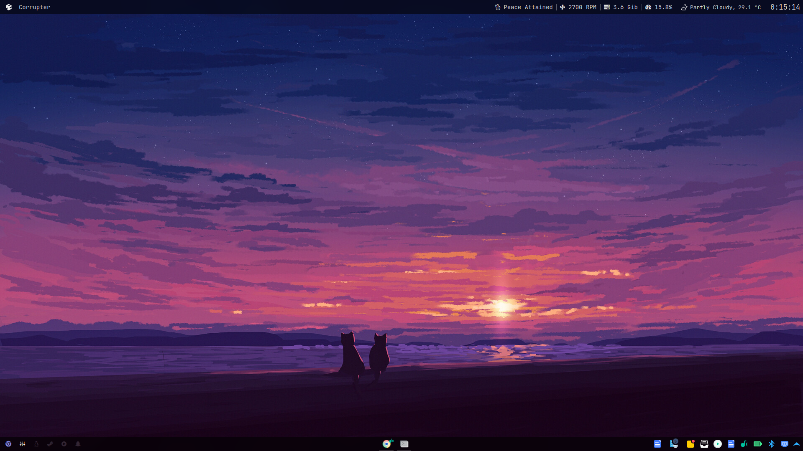
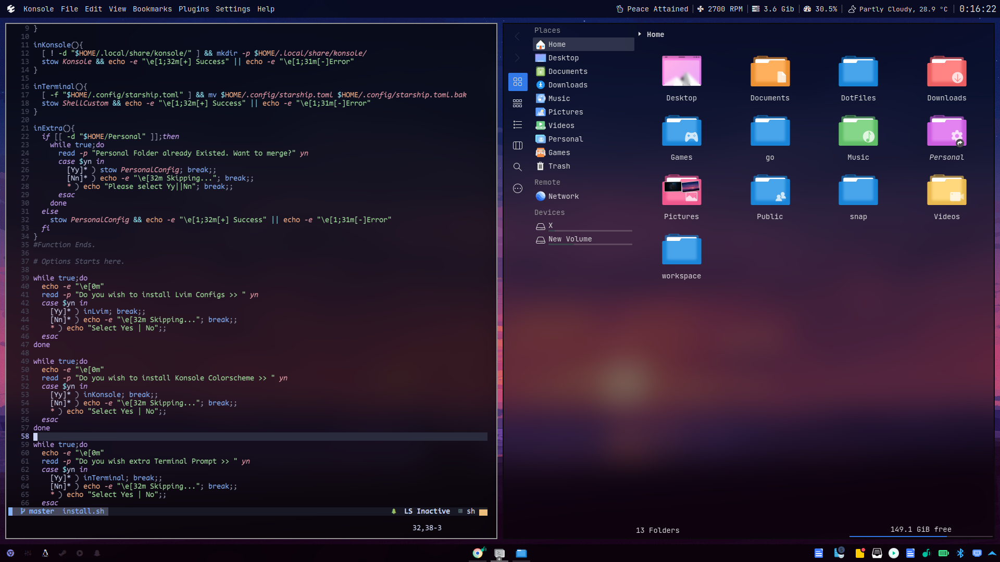

<div align="justify">

<div align="center">

```ocaml
NEVER SKIP / IGNORE / AVOID README
```

```css
      __/)   ‌‌‌‌‬‬‬‍ ‌‌‌‌‌‬‌‌   ‌‌‌‌‌‌‬ ‌‌‌‌‌‌‌‌‌‌‌‌‌‬        ‌‌‌‌‌‌‬_      ‌‌‌‌‌‬‌‌_       ‌‌‌‌‍‬  ‌‌‌‌‍‍ 
   .‌‌‌‌‍‬‌-(_‌‌‌‌‌‍‌_(=:   |   ‌‌‌‌‍‬‌   ‌‌‌‌‍‬‍‍   ‌‌‌‌‌‬‌‌ | | o  | |     ‌‌‌‌‌‌    
‌‌‌‌‍‬‌‍|\ |    \) ‌‌‌‌‍‬‌ _‌‌‌‌‍‍‌_| ‌‌‌‌‍‬‍‍  __ ‌‌‌‌‍‌‬_|‌‌‌‌‍‬‬_ | |‌‌‌‌‍‬‌‍    |‌‌‌‌‍‍‌ |  _ ‌‌‌‌‍‬‍‍  , ‌‌‌‌‌‬‍ 
‌‌‌‌‍‌\‌‌‌‌‍‬‍‍ ||       / ‌‌‌‌‌‍ ‌‌‌‌‍‬‍‍|  /  \_|  |/‌‌‌‌‍‬‬  |  |/  |/  / \‌‌‌‌‍‌‌‌‌‌‌‌‍‌‌_
 \||     ‌‌‌‌‍‬‍  \_/|_/\__/ |_‌‌‌‌‌‬‬/‌‌‌‌‍‬‍|__/|_‌‌‌‌‍‬‍‍/|__/‌‌‌‌‌‬|__/ \/ 
  \|                     |\                 
   |  4b 61 72 74 69 6b  |/  with aesthetics
```

</div>

### :octocat: ‎ <sup><sub><samp>HI THERE! THANKS FOR DROPPING BY!</samp></sub></sup>





