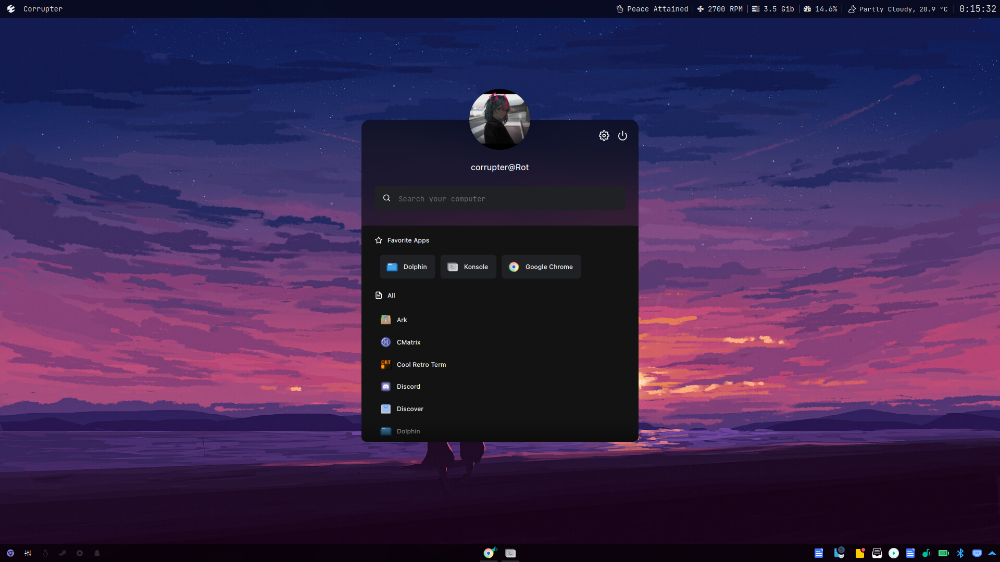

<div align="justify">

<div align="center">

```ocaml
NEVER SKIP / IGNORE / AVOID README
```

```css
      __/)   ‌‌‌‌‬‬‬‍ ‌‌‌‌‌‬‌‌   ‌‌‌‌‌‌‬ ‌‌‌‌‌‌‌‌‌‌‌‌‌‬        ‌‌‌‌‌‌‬_      ‌‌‌‌‌‬‌‌_       ‌‌‌‌‍‬  ‌‌‌‌‍‍ 
   .‌‌‌‌‍‬‌-(_‌‌‌‌‌‍‌_(=:   |   ‌‌‌‌‍‬‌   ‌‌‌‌‍‬‍‍   ‌‌‌‌‌‬‌‌ | | o  | |     ‌‌‌‌‌‌    
‌‌‌‌‍‬‌‍|\ |    \) ‌‌‌‌‍‬‌ _‌‌‌‌‍‍‌_| ‌‌‌‌‍‬‍‍  __ ‌‌‌‌‍‌‬_|‌‌‌‌‍‬‬_ | |‌‌‌‌‍‬‌‍    |‌‌‌‌‍‍‌ |  _ ‌‌‌‌‍‬‍‍  , ‌‌‌‌‌‬‍ 
‌‌‌‌‍‌\‌‌‌‌‍‬‍‍ ||       / ‌‌‌‌‌‍ ‌‌‌‌‍‬‍‍|  /  \_|  |/‌‌‌‌‍‬‬  |  |/  |/  / \‌‌‌‌‍‌‌‌‌‌‌‌‍‌‌_
 \||     ‌‌‌‌‍‬‍  \_/|_/\__/ |_‌‌‌‌‌‬‬/‌‌‌‌‍‬‍|__/|_‌‌‌‌‍‬‍‍/|__/‌‌‌‌‌‬|__/ \/ 
  \|                     |\                 
   |  4b 61 72 74 69 6b  |/  with aesthetics
```

</div>

### :octocat: ‎ <sup><sub><samp>HI THERE! THANKS FOR DROPPING BY!</samp></sub></sup>





---

### About:
## 1. Personal Config consist of the following:
   - **newrc** -> This is my own config file which consist of alias and some enviroment variables.
   - **bin** -> Contains all my personal/online scripts which I may use on daily basis.
   - **KargosWidgets** -> This folder contain all the scripts for the KargosWidgets which I have used throughout my system, like CPU,MEM etc.

## 2. Kargos:
   If you want to use kargos make sure you have Kargos installed from github. I am using [Kargos-v0.6.0](https://github.com/lipido/kargos/tree/v0.6.0) as there were some problems with recent ones.
   You can place widget any way you want.

## 3. StarShip Prompt:
   There is a shell prompt in **ShellCustom**. If you like it you may use it.

